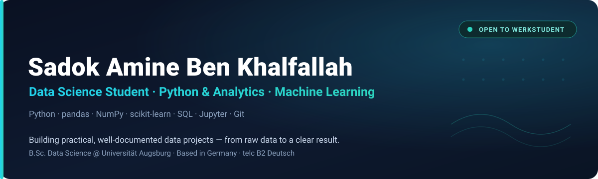
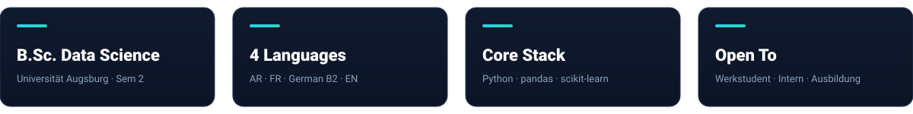

  

  
  
  
  

  

## 🚀 About Me

I am a **Bachelor Data Science student at Universität Augsburg** (2nd semester) who learns by shipping small, complete projects — from raw data all the way to a clear, well-documented result.

My focus is turning data into something useful and understandable: clean analysis, honest metrics, and readable documentation. My goal is to grow into a **Werkstudent or junior data/IT role in Germany**, contributing real work while I finish my degree.

- 📈 Currently building projects in **data analysis, machine-learning foundations, and reproducible notebooks**
- 🧪 Prior hands-on experience in **IT support and data/product support**
- 🎯 I care about **connecting technical work with business value** — what a project solves and who it helps
- 🌍 Multilingual: **Arabic (native), French, German (telc B2), English**

## 🧰 Tech Stack

| Domain | Tools |
| --- | --- |
| **Programming & Data** |     |
| **Machine Learning** |    |
| **Visualization** |   |
| **Workflow & Tools** |    |

## 📌 Featured Projects

| Project | What it shows | Status |
| --- | --- | --- |
| **[ML Foundations Project](https://github.com/Sadokamine12/ml-foundations-project)** Classification (KNN), regression, and clustering (k-Means) with scikit-learn — train/test split, evaluation metrics, and plots. | The full ML workflow: prepare data → train → predict → evaluate → visualize. | ✅ Complete |
| **[Student Performance Analytics](https://github.com/Sadokamine12/student-performance-analytics)** EDA and a baseline performance-risk model on a clearly labelled simulated dataset, with real metrics and honest limitations. | Connecting analysis to a real-world problem and communicating results responsibly. | ✅ Complete |

## 🎯 What I Bring

- **Practical learning speed** — I build small, complete projects that show the whole workflow, not isolated snippets.
- **Business-oriented thinking** — I explain what a project solves, who benefits, and why the result matters.
- **Clear documentation** — readable READMEs, sensible structure, and honest findings that separate results from limitations.
- **Germany-ready** — based in Germany, telc B2 German, open to Werkstudent, internship, Ausbildung, and junior data/IT roles.

## 📚 Currently Learning

- Machine-learning foundations with scikit-learn
- SQL for data analysis and reporting
- Data visualization and clear result communication
- Reproducible project structure and documentation

## 🌐 Languages

| Language | Level |
| --- | --- |
| 🇹🇳 Arabic | Native |
| 🇫🇷 French | Fluent / academic working language |
| 🇩🇪 German | telc B2 |
| 🇬🇧 English | Professional working proficiency |

## 📊 GitHub Stats

  
  

## 📫 Contact

Open to **Werkstudent roles, internships, Ausbildung, junior Data Analyst, junior Python, QA testing, and AI automation opportunities in Germany.** German CV available on request.

  
  

